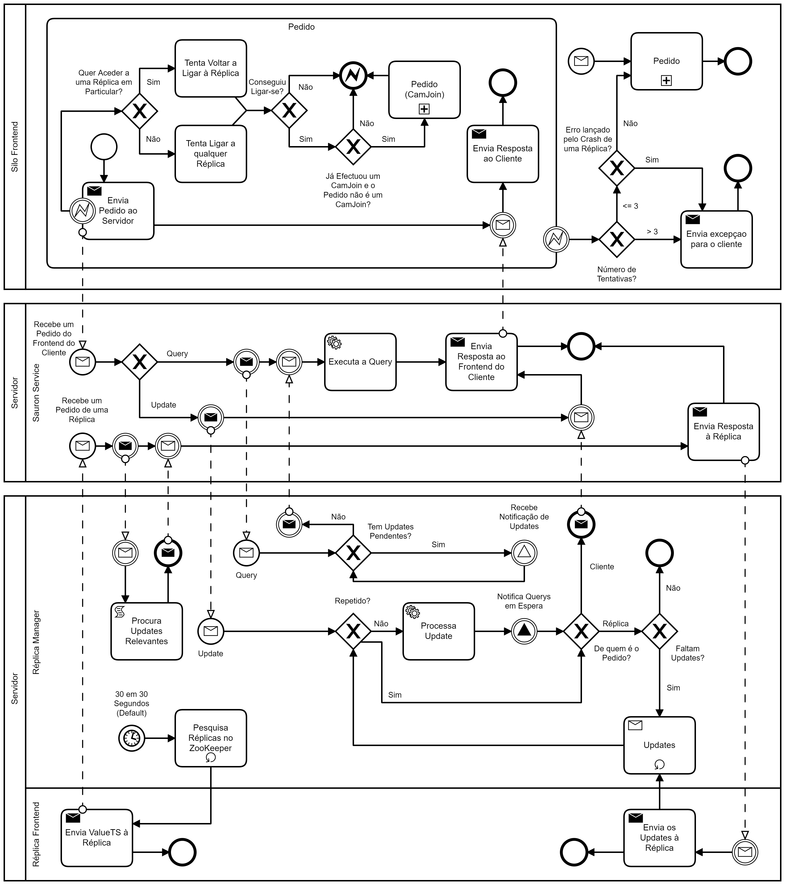

# Relatório do Projeto Sauron

Sistemas Distribuídos 2019-2020, Segundo Semestre

## Autores
**Grupo T18**

| Número | Nome              | Utilizador                              | Correio eletrónico                                              |
| -------|-------------------|-----------------------------------------| ----------------------------------------------------------------|
| 86923  | Sara Machado      | <https://github.com/SaraMachado>        | <mailto:sara.f.machado@tecnico.ulisboa.pt>                      |
| 90770  | Rafael Figueiredo | <https://github.com/RafaelAlexandreIST> | <mailto:rafael.alexandre.roberto.figueiredo@tecnico.ulisboa.pt> |
| 90774  | Ricardo Grade     | <https://github.com/Opty1337>           | <mailto:ricardo.grade@tecnico.ulisboa.pt>                       |

  

## Melhorias da Primeira Parte

- Corrigimos no `spotter` a ordenação das `Observações` por `IDs` para `Persons` no comando `spot` -> [Commit](https://github.com/tecnico-distsys/T18-Sauron/commit/3ab5ad9ea5e241dd4caebdf4ee85866c1b3ea635)
- Adicionámos a restrição dos nomes das `Cãmeras` serem alfa-numéricos e adicionámos o Teste correspondente a esta restrição -> [Commit](https://github.com/tecnico-distsys/T18-Sauron/commit/efdc113ef2399bf885883a99895e16b96d801c41)
- De modo a abstrairmo-nos do protocolo de comunicação utilizado:
  - Passámos a lançar exceções `SauronException` em vez de `StatusRunTimeException` no `Sauron` -> [Commit](https://github.com/tecnico-distsys/T18-Sauron/commit/efdc113ef2399bf885883a99895e16b96d801c41)
  - Passámos a utilizar Classes de domínio em vez de utilizar Classes do `GRPC` -> [Commit](https://github.com/tecnico-distsys/T18-Sauron/commit/e4d7f783a04ef1034e546e342125cd80508e4f2d)

## Modelo de Faltas

Faltas Toleradas:
- Crash de uma réplica à qual clientes estavam conectados, ou outras réplicas estavam a trocar mensagens `Gossip`.
- Receção de Updates repetidos.
- Leitura realizada por um cliente que tenha solicitado Updates numa dada réplica, os quais ainda não tenham sido propagados até à réplica corrente.
- Update `report` numa dada réplica onde o `cam_join` da camera correspondente ainda não foi propagado.

Faltas não Toleradas:
- Faltas no *ZooKeeper*.
- Quando o cliente tenta conectar-se sem sucesso *Y* vezes seguidas ao servidor (Default: *Y* = 3).

## Solução

### Descrição

- A réplica do servidor regista-se no *ZooKeeper* com o path */grpc/sauron/silo*`/instance`, ficando acessível para responder a queries e executar updates de clientes. Esta guarda um Timestamp (`valueTS`) correspondente à versão em que se encontra.
- Quando um cliente (`Eye` ou `Spotter`) se inicia pode-lhe ser passado a `instance` da réplica do servidor a que se pretende conectar. Caso esta não seja passada o cliente conecta-se a uma réplica aleatória que esteja registada no *ZooKeeper*.
- Quando um cliente envia um update, este é executado no momento, uma vez que não existem dependências causais entre updates, que por conseguinte leva a atualização do `valueTS` da réplica correspondente. Sendo o update também guardado no `UpdateLog` da mesma, para o propagar pelas restantes. De seguida, é devolvido ao cliente o Timestamp atualizado do update, para que este possa manter a coerência na leitura.
- Quando um cliente envia uma query, o Timestamp da mesma (`queryTS`) é consultado com o objetivo de verificar se esta pode ser realizada no momento.
    - Caso não possa (`queryTS > valueTS`), é colocada em espera até ser notificada da execução de novos updates, voltando a verificar se a query já pode ser realizada, se não volta a esperar por notificações.
    - Caso possa, esta é realizada e o `valueTS` da réplica é devolvido ao cliente com o mesmo propósito que é devolvido num update.
- De *X* em *X* segundos (Default: *X* = 30) são pesquisadas todas as réplicas registadas no *ZooKeeper* e updates relevantes são trocados entre elas.
- Quando o frontend do cliente (`SiloFrontend`) deteta o crash de uma réplica:
    - Caso seja atribuída uma instance especifica ao cliente, volta a tentar conectar-se à réplica correspondente, no máximo *Y* vezes. Caso não lhe tenha sido atribuída uma instance especifica, volta a tentar conectar-se com qualquer réplica registada no *ZooKeeper*, no máximo *Y* vezes (Default: *Y* = 3).
    - Caso a reconexão seja bem sucedida e um pedido de `cam_join` já tenha sido enviado anteriormente, volta a fazê-lo, para garantir que a câmara se encontra registada na nova réplica, antes de fazer qualquer `report`. 
    - Após *Y* tentativas mal sucedidas, o frontend do cliente (`SiloFrontend`) propaga a exceção para o cliente;
- De modo a que o número de segundos entre mensagens `Gossip` seja manipulável, este foi acrescentado como uma property (`sync`) no `Server`.Bem como o timeout dos requests e o número de tentativas para estabelecer conexão (respectivamente `timeout`e `retries`) no `Server` e nos clientes (`Eye` e `Spotter`).

## Protocolo de Replicação

- O protocolo de replicação utilizado foi uma variante do *Gossip architecture*, em que não são usadas dependências causais entre updates.

- O protocolo consiste em:
    - Cada réplica mantém um Timestamp correspondente à sua versão do servidor, para dar a conhecer às outras réplicas quais os updates que esta necessita.
    - Cada réplica memoriza cada um dos updates efetuados de modo a propaga-los para as restantes, mantendo a replicação de dados.
    - Cada update possui o Timestamp em que ocorreu.
    - Na lista de updates enviada nas mensagens entre réplicas constam todos os updates cujo Timestamp é concorrente ou maior que o Timestamp da réplica que efectuou o pedido, por forma a não enviar updates desnecessários.
    - Uma query só é realizada quando o seu Timestamp não é menor que o `valueTS`, possibilitando assim a coerência na leitura dos clientes entre diferentes réplicas.
- As trocas de mensagens entre réplicas consistem em:
    - As mensagens trocadas entre réplicas são enviadas em `GRPC`. 
    - De *X* em *X* segundos (Default: *X* = 30) são pesquisadas todas as réplicas registadas no *ZooKeeper* e trocadas estas mensagens, de modo a propagarem os updates recebidos entre si. 
    - No pedido é enviado o `valueTS` da réplica corrente, para que o destinatário tenha conhecimento da versão do servidor da réplica que executa o pedido.
    - A replica que recebe o pedido, pesquisa com base no `valueTS` recebido quais os updates que esta necessita.
    - Na receção da mensagem, os updates são executados por ordem crescente de Timestamp, caso estes não tenham sido já executados. 
    
## Opções de Implementação

- Paralelismo nas mensagens trocadas entre as réplicas conhecidas pelo *ZooKeeper* através do uso de non-blocking stubs.
- Com o objectivo de melhorar a eficiencia da troca de updates entre réplicas, enviamos juntamente com o pedido o `valueTS` da réplica corrente para a que recebe o pedido saber exatamente quais os updates que esta necessita.
- Para solucionar o problema de crash de uma réplica à qual já se tenha solicitado um `cam_join` o qual não chegou a ser propagado pelas réplicas vizinhas, guardamos o `request` do último `cam_join` e reenviamo-lo na reconexão com outra réplica. Não gerando este qualquer problema, uma vez que o pedido `cam_join` é um update idempotente.
- Na receção de um update, este é automaticamente executado, se não for repetido, uma vez que não existem dependências causais entre updates.
